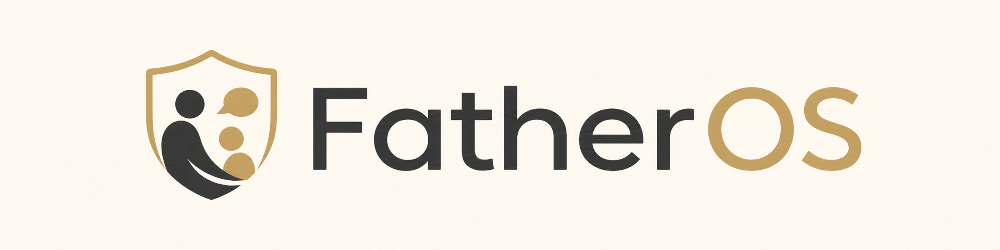
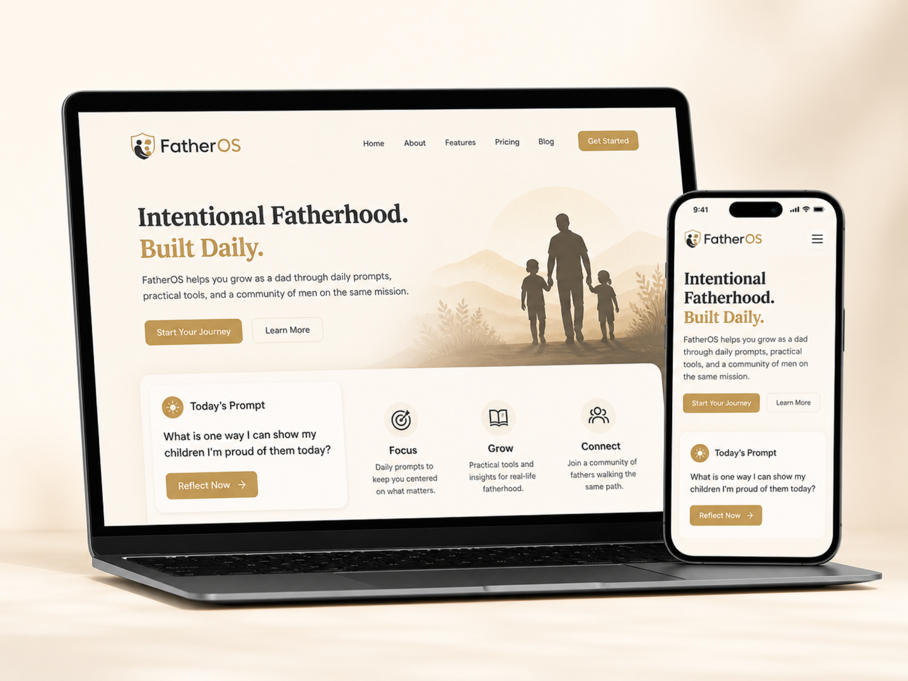

# FatherOS

A polished mini product website for intentional fatherhood.

## Files

```text
index.html
styles.css
prompts.js
script.js
assets/images/
README.md
```

## How it works

- `index.html` is the website structure.
- `styles.css` controls the design.
- `prompts.js` is your prompt library.
- `script.js` runs the daily prompt, random prompt button, categories, and animation.

## Important

In `index.html`, these scripts must stay in this order:

```html
<script src="prompts.js"></script>
<script src="script.js"></script>
```

## Add more prompts

Open `prompts.js` and add another object inside the `prompts` array:

```js
{
  id: 21,
  category: "Connection",
  prompt: "Ask your child: “What was your favorite moment today?”",
  followUp: "Then ask: “What made it stand out?”"
}
```

## Deploy

Upload these files to GitHub Pages.


## Image Asset Naming

```text
assets/images/
  logo-wordmark.png   # visible header logo
  favicon.png         # browser tab icon and Apple touch icon
  og-preview.png      # social/text message preview image
  site-mockup.png     # visible product mockup section
```

## Where images are coded

In `index.html`:

```html
<link rel="icon" type="image/png" href="assets/images/favicon.png" />
<meta property="og:image" content="assets/images/og-preview.png" />


```

Important: when the site is live on GitHub Pages, the `og:image` may work better as a full URL.
